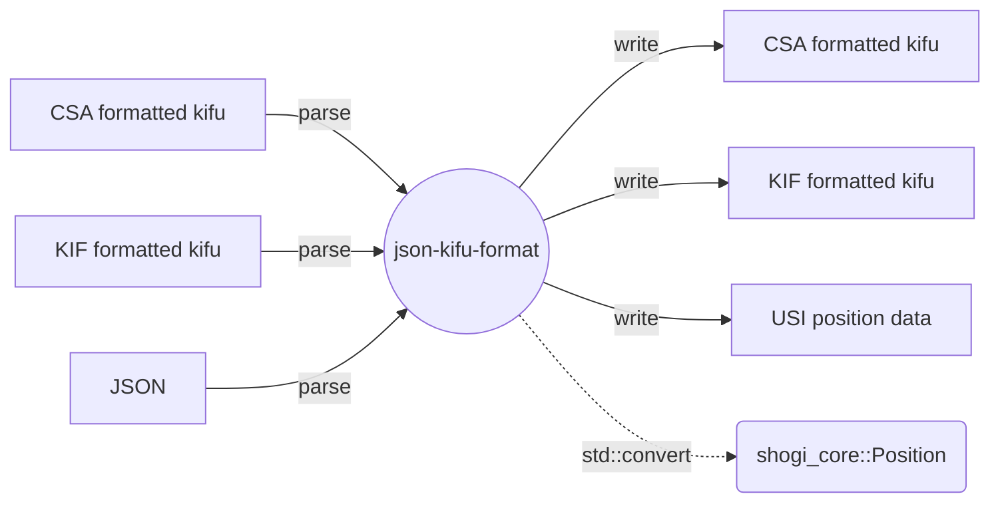

[](https://github.com/sugyan/shogi-kifu-converter/actions/workflows/rust.yml)

# shogi-kifu-converter

A Rust library that defines structs compatible with [json-kifu-format](https://github.com/na2hiro/json-kifu-format), containing parsers and converters for Shogi kifu (game record) for converting to and from json-kifu-format. And, it also provides conversion from `JsonKifuFormat` type to [`shogi_core`](https://crates.io/crates/shogi_core)'s `Position` type.



## About json-kifu-format (JKF)

See https://github.com/na2hiro/json-kifu-format.

## Examples

```sh
cargo run --example csa2jkf <CSA file>
cargo run --example csa2kif <CSA file>
cargo run --example kif2jkf <KIF file>
cargo run --example kif2csa <KIF file>
cargo run --example jkf2usi <JKF file>
```
